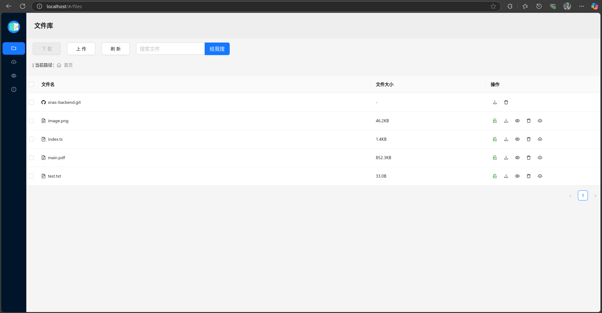

# xnas frontend

## install

```bash
git clone git@github.com:Magnstiff/doc-share-store-frontend.git
cd doc-share-store-frontend
npm install / yarn install
npm run vue
```

## start to use

go localhost to see ui

## feature


